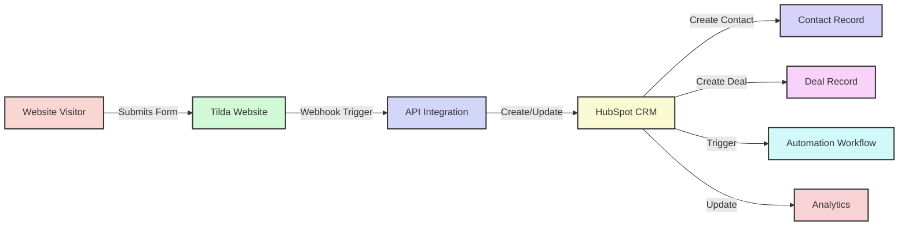
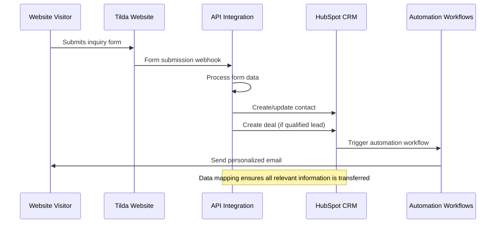
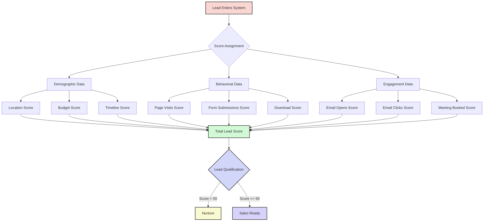
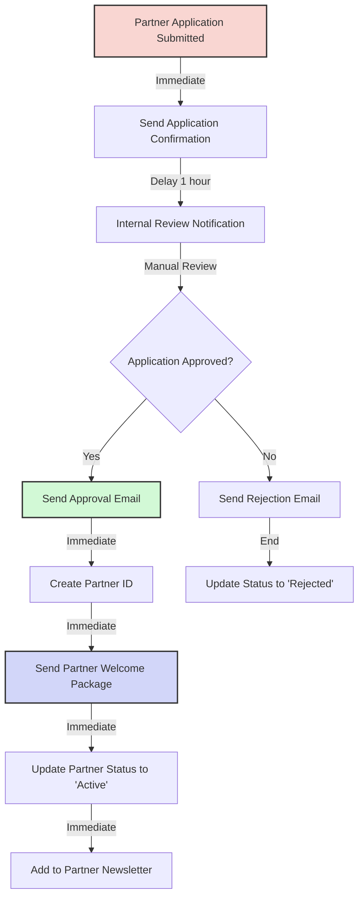
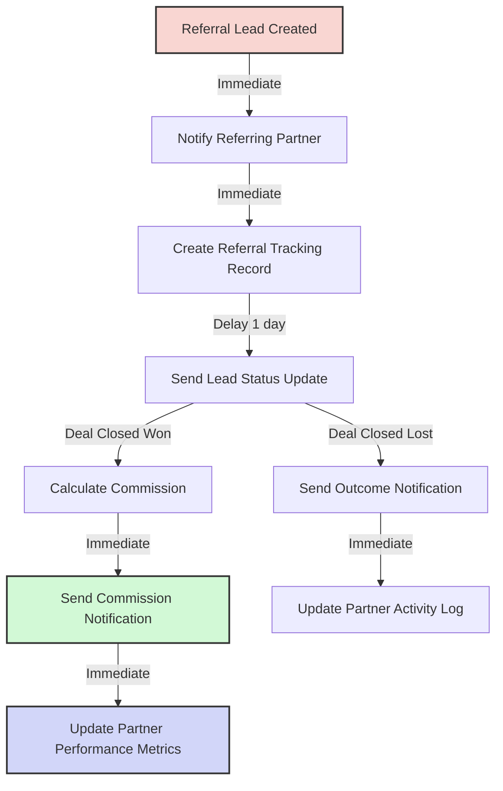
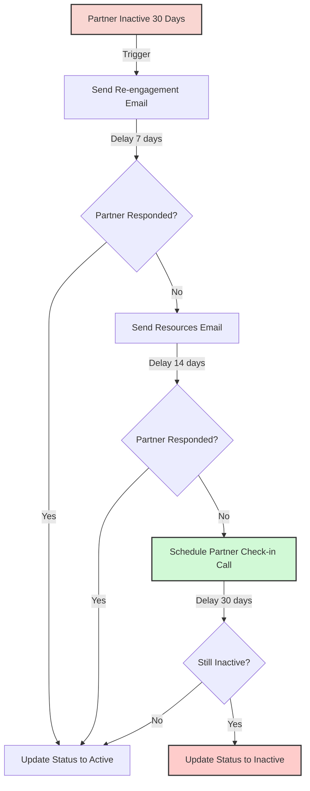
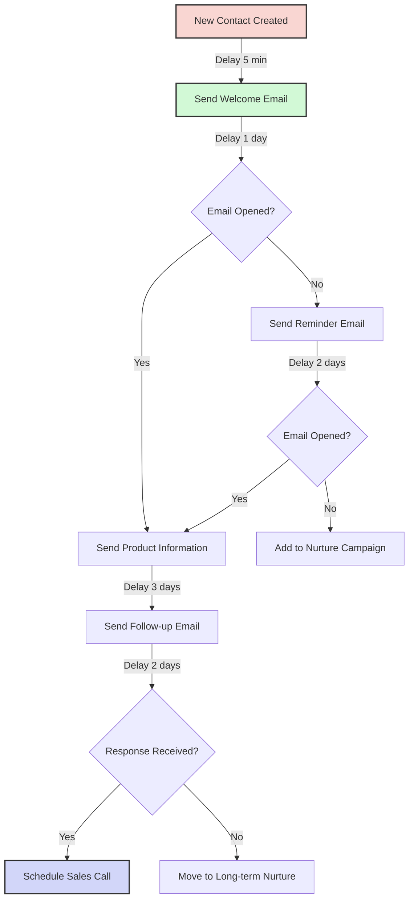
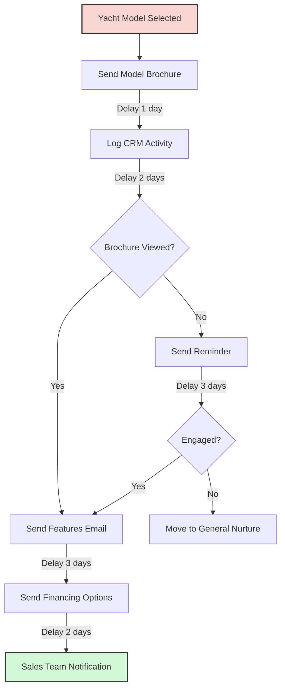

# HubSpot CRM Integration Guide

This guide explains how to integrate the Azure Yacht Group Tilda API with HubSpot CRM to create a seamless lead management system.

## Table of Contents

1. [Overview](#overview)
2. [Architecture](#architecture)
3. [Prerequisites](#prerequisites)
4. [Implementation Steps](#implementation-steps)
5. [Form Integration](#form-integration)
6. [Lead Management](#lead-management)
7. [Automated Workflows](#automated-workflows)
8. [Reporting & Analytics](#reporting--analytics)
9. [Testing & Validation](#testing--validation)

## Overview

The HubSpot CRM integration enables Azure Yacht Group to:

- Automatically capture website leads in HubSpot CRM
- Track customer interactions across touchpoints
- Implement lead scoring and qualification
- Set up automated follow-up sequences
- Track sales pipeline and conversions
- Generate comprehensive reports and analytics



## Architecture

The integration follows this architectural pattern:



## Prerequisites

Before implementing the integration, ensure you have:

1. **HubSpot Account:**
   - Marketing Hub Professional or Enterprise subscription
   - API credentials with proper permissions

2. **Tilda Website Setup:**
   - Tilda Business Plan subscription
   - Forms configured for lead capture
   - Webhook functionality enabled

3. **API Integration:**
   - Functioning Tilda API integration
   - Server with Node.js environment
   - HTTPS endpoint for secure communication

## Implementation Steps

### Step 1: Set Up HubSpot API Connection

1. **Install HubSpot Node.js SDK:**
   ```bash
   npm install @hubspot/api-client
   ```

2. **Configure API Client:**
   ```javascript
   // src/services/hubspotApi.js
   const hubspot = require('@hubspot/api-client');
   const config = require('../config');
   
   class HubSpotApiService {
     constructor() {
       this.client = new hubspot.Client({ 
         accessToken: config.hubspot.apiKey 
       });
     }
     
     // Service methods will be implemented here
   }
   
   module.exports = new HubSpotApiService();
   ```

3. **Add Configuration:**
   ```javascript
   // In src/config.js, add:
   hubspot: {
     apiKey: process.env.HUBSPOT_API_KEY,
     portalId: process.env.HUBSPOT_PORTAL_ID
   }
   ```

4. **Update Environment Variables:**
   ```
   # In .env file, add:
   HUBSPOT_API_KEY=your_hubspot_api_key
   HUBSPOT_PORTAL_ID=your_hubspot_portal_id
   ```

### Step 2: Create HubSpot Properties Mapping

1. **Define Property Mapping:**
   ```javascript
   // src/utils/hubspotMapper.js
   function mapFormToContact(formData) {
     return {
       properties: {
         email: formData.email,
         firstname: formData.firstName || formData.name?.split(' ')?.[0] || '',
         lastname: formData.lastName || formData.name?.split(' ')?.[1] || '',
         phone: formData.phone || '',
         yacht_model_interest: formData.yachtModel || '',
         lead_source: 'Website Form',
         website_form_type: formData.formType || 'General Inquiry',
         message: formData.message || '',
       }
     };
   }
   
   function mapFormToDeal(formData, contactId) {
     return {
       properties: {
         dealname: `${formData.name || 'Website Lead'} - ${formData.yachtModel || 'Yacht Inquiry'}`,
         dealstage: 'qualifiedtobuy',
         pipeline: 'default',
         amount: formData.budget || '',
         yacht_model: formData.yachtModel || '',
         hubspot_owner_id: formData.assignedTo || '',
         description: formData.message || ''
       },
       associations: [{
         to: { id: contactId },
         types: [{ category: 'HUBSPOT_DEFINED', typeId: 3 }] // Contact to deal association
       }]
     };
   }
   
   module.exports = {
     mapFormToContact,
     mapFormToDeal
   };
   ```

2. **Create Custom Properties in HubSpot:**
   - Access Settings > Properties in HubSpot
   - Create custom properties for yacht model, budget, etc.
   - Set appropriate field types and options

### Step 3: Implement Core API Methods

1. **Create Contact Methods:**
   ```javascript
   // In HubSpotApiService class
   
   /**
    * Create or update a contact in HubSpot
    * @param {object} formData - The form data submitted by the user
    */
   async createOrUpdateContact(formData) {
     try {
       const contactProperties = mapFormToContact(formData);
       
       // Check if contact exists
       const contacts = await this.client.crm.contacts.searchApi.doSearch({
         filterGroups: [{
           filters: [{
             propertyName: 'email',
             operator: 'EQ',
             value: formData.email
           }]
         }]
       });
       
       if (contacts.results && contacts.results.length > 0) {
         // Update existing contact
         const contactId = contacts.results[0].id;
         await this.client.crm.contacts.basicApi.update(contactId, contactProperties);
         return { contactId, isNew: false };
       } else {
         // Create new contact
         const newContact = await this.client.crm.contacts.basicApi.create(contactProperties);
         return { contactId: newContact.id, isNew: true };
       }
     } catch (error) {
       throw new Error(`Failed to create/update contact: ${error.message}`);
     }
   }
   ```

2. **Create Deal Method:**
   ```javascript
   /**
    * Create a deal in HubSpot linked to a contact
    * @param {object} formData - The form data submitted by the user
    * @param {string} contactId - The HubSpot contact ID
    */
   async createDeal(formData, contactId) {
     try {
       const dealProperties = mapFormToDeal(formData, contactId);
       const deal = await this.client.crm.deals.basicApi.create(dealProperties);
       return deal.id;
     } catch (error) {
       throw new Error(`Failed to create deal: ${error.message}`);
     }
   }
   ```

3. **Log Activity Method:**
   ```javascript
   /**
    * Log activity for a contact
    * @param {string} contactId - The HubSpot contact ID
    * @param {string} title - Activity title
    * @param {string} description - Activity description
    */
   async logActivity(contactId, title, description) {
     try {
       const engagement = {
         engagement: {
           type: 'NOTE' 
         },
         associations: {
           contactIds: [contactId]
         },
         metadata: {
           body: description
         }
       };
       
       await this.client.engagements.engagementsApi.create(engagement);
     } catch (error) {
       throw new Error(`Failed to log activity: ${error.message}`);
     }
   }
   ```

### Step 4: Create Form Submission Controller

```javascript
// src/controllers/hubspotController.js
const hubspotApi = require('../services/hubspotApi');
const logger = require('../utils/logger');

/**
 * Handle form submissions and create HubSpot records
 */
exports.handleFormSubmission = async (req, res) => {
  try {
    const formData = req.body;
    
    // Validate required fields
    if (!formData.email) {
      return res.status(400).json({ 
        success: false, 
        error: 'Email is required' 
      });
    }
    
    // Create or update contact
    const { contactId, isNew } = await hubspotApi.createOrUpdateContact(formData);
    
    // Log activity
    await hubspotApi.logActivity(
      contactId, 
      'Website Form Submission',
      `Form submitted from ${formData.formType || 'website'} form. Message: ${formData.message || 'No message'}`
    );
    
    // Create deal if it's a qualified lead
    let dealId = null;
    if (formData.yachtModel || formData.budget) {
      dealId = await hubspotApi.createDeal(formData, contactId);
    }
    
    // Return success response
    res.json({
      success: true,
      contactId,
      dealId,
      isNewContact: isNew
    });
    
    logger.info(`HubSpot record created - Contact: ${contactId}, Deal: ${dealId || 'None'}`);
  } catch (error) {
    logger.error('Failed to process form submission: %s', error.message);
    res.status(500).json({ success: false, error: error.message });
  }
};
```

### Step 5: Add API Routes

```javascript
// src/routes/hubspotRoutes.js
const express = require('express');
const router = express.Router();
const hubspotController = require('../controllers/hubspotController');

// Form submission endpoint
router.post('/form-submission', hubspotController.handleFormSubmission);

module.exports = router;
```

Add to main app.js:

```javascript
// In app.js
const hubspotRoutes = require('./routes/hubspotRoutes');

// Add HubSpot routes
app.use('/api/hubspot', hubspotRoutes);
```

## Referral Partner Page Integration

### Tilda Referral Partner Page Setup

The referral partner page requires specific HubSpot integration to capture partner applications and track referral activities.

#### Partner Application Form Integration

1. **Create Partner Contact Properties in HubSpot:**
   ```javascript
   // Partner-specific properties to add in HubSpot
   const partnerProperties = [
     {
       name: 'partner_status',
       label: 'Partner Status',
       type: 'enumeration',
       options: ['Applied', 'Under Review', 'Approved', 'Active', 'Inactive']
     },
     {
       name: 'partner_type',
       label: 'Partner Type',
       type: 'enumeration',
       options: ['Travel Advisor', 'Concierge Service', 'Event Planner', 'Wealth Manager', 'Real Estate', 'Other']
     },
     {
       name: 'partner_id',
       label: 'Partner ID',
       type: 'string'
     },
     {
       name: 'business_type',
       label: 'Business Type',
       type: 'string'
     },
     {
       name: 'years_in_business',
       label: 'Years in Business',
       type: 'number'
     },
     {
       name: 'client_budget_range',
       label: 'Client Budget Range',
       type: 'enumeration',
       options: ['$5,000-$10,000', '$10,000-$25,000', '$25,000-$50,000', '$50,000+']
     },
     {
       name: 'expected_referrals_yearly',
       label: 'Expected Referrals Per Year',
       type: 'enumeration',
       options: ['1-5', '6-10', '11-25', '25+']
     }
   ];
   ```

2. **Partner Application Form Mapping:**
   ```javascript
   // src/utils/partnerMapper.js
   function mapPartnerApplicationToContact(formData) {
     return {
       properties: {
         email: formData.businessEmail,
         firstname: formData.firstName || formData.name?.split(' ')?.[0] || '',
         lastname: formData.lastName || formData.name?.split(' ')?.[1] || '',
         phone: formData.phone || '',
         company: formData.companyName || '',
         website: formData.websiteUrl || '',
         jobtitle: formData.titlePosition || '',
         partner_status: 'Applied',
         partner_type: formData.businessType || '',
         business_type: formData.industryType || '',
         years_in_business: formData.yearsInBusiness || '',
         client_budget_range: formData.clientBudgetRange || '',
         expected_referrals_yearly: formData.expectedReferrals || '',
         lead_source: 'Partner Application Form',
         hs_lead_status: 'NEW'
       }
     };
   }
   
   module.exports = { mapPartnerApplicationToContact };
   ```

3. **Partner Application Workflow:**
   ```javascript
   // In HubSpotApiService class
   async processPartnerApplication(formData) {
     try {
       // Create contact with partner properties
       const contactProperties = mapPartnerApplicationToContact(formData);
       const contact = await this.createOrUpdateContact(contactProperties);
       
       // Create a deal for partner onboarding
       const dealProperties = {
         properties: {
           dealname: `Partner Application - ${formData.companyName}`,
           dealstage: 'qualifiedtobuy',
           pipeline: 'partner_onboarding', // Create custom pipeline
           amount: 0,
           description: `Partner application from ${formData.companyName}. Expected ${formData.expectedReferrals} referrals per year.`
         },
         associations: [{
           to: { id: contact.id },
           types: [{ category: 'HUBSPOT_DEFINED', typeId: 3 }]
         }]
       };
       
       const deal = await this.client.crm.deals.basicApi.create(dealProperties);
       
       // Trigger partner review workflow
       await this.triggerPartnerReviewWorkflow(contact.id);
       
       return { contact, deal };
     } catch (error) {
       console.error('Error processing partner application:', error);
       throw error;
     }
   }
   ```

4. **Tilda Form Configuration:**
   ```html
   <!-- Partner Application Form Block (T123) -->
   <form id="partner-application-form" action="/api/partner-application" method="POST">
     <!-- Company Information -->
     <input type="text" name="companyName" placeholder="Company/Organization Name*" required>
     <input type="text" name="name" placeholder="Your Name*" required>
     <input type="text" name="titlePosition" placeholder="Title/Position*" required>
     <input type="email" name="businessEmail" placeholder="Business Email*" required>
     <input type="tel" name="phone" placeholder="Phone Number*" required>
     <input type="url" name="websiteUrl" placeholder="Website URL">
     
     <!-- Business Details -->
     <select name="industryType" required>
       <option value="">Industry/Business Type*</option>
       <option value="Travel Advisor">Travel Advisor/Agency</option>
       <option value="Concierge Service">Concierge Service</option>
       <option value="Event Planner">Event Planner</option>
       <option value="Wealth Manager">Wealth Management</option>
       <option value="Real Estate">Real Estate</option>
       <option value="Other">Other</option>
     </select>
     
     <select name="yearsInBusiness" required>
       <option value="">Years in Business*</option>
       <option value="1-2">1-2 years</option>
       <option value="3-5">3-5 years</option>
       <option value="6-10">6-10 years</option>
       <option value="10+">10+ years</option>
     </select>
     
     <select name="clientBudgetRange">
       <option value="">Average Client Charter Budget Range</option>
       <option value="$5,000-$10,000">$5,000-$10,000</option>
       <option value="$10,000-$25,000">$10,000-$25,000</option>
       <option value="$25,000-$50,000">$25,000-$50,000</option>
       <option value="$50,000+">$50,000+</option>
     </select>
     
     <textarea name="clientDemographics" placeholder="Primary Client Demographics"></textarea>
     
     <!-- Partnership Interest -->
     <select name="hearAboutUs">
       <option value="">How did you hear about us?</option>
       <option value="Google Search">Google Search</option>
       <option value="Social Media">Social Media</option>
       <option value="Referral">Referral</option>
       <option value="Industry Event">Industry Event</option>
       <option value="Other">Other</option>
     </select>
     
     <select name="expectedReferrals">
       <option value="">Expected referrals per year</option>
       <option value="1-5">1-5</option>
       <option value="6-10">6-10</option>
       <option value="11-25">11-25</option>
       <option value="25+">25+</option>
     </select>
     
     <textarea name="additionalComments" placeholder="Additional comments"></textarea>
     
     <button type="submit">Submit Partner Application</button>
   </form>
   ```

#### Partner Referral Tracking

1. **Referral Contact Properties:**
   ```javascript
   const referralProperties = [
     {
       name: 'referral_partner_id',
       label: 'Referral Partner ID',
       type: 'string'
     },
     {
       name: 'referral_source_partner',
       label: 'Referral Source Partner',
       type: 'string'
     },
     {
       name: 'is_referral_lead',
       label: 'Is Referral Lead',
       type: 'bool'
     }
   ];
   ```

2. **Referral Tracking Integration:**
   ```javascript
   async processReferralLead(formData, partnerCode) {
     try {
       // Find partner by code
       const partner = await this.findPartnerByCode(partnerCode);
       
       // Create contact with referral tracking
       const contactProperties = {
         ...mapFormToContact(formData),
         properties: {
           ...mapFormToContact(formData).properties,
           referral_partner_id: partnerCode,
           referral_source_partner: partner?.company || '',
           is_referral_lead: true,
           lead_source: 'Partner Referral'
         }
       };
       
       const contact = await this.createOrUpdateContact(contactProperties);
       
       // Create deal with partner attribution
       const dealProperties = {
         ...mapFormToDeal(formData, contact.id),
         properties: {
           ...mapFormToDeal(formData, contact.id).properties,
           referral_partner_id: partnerCode,
           deal_type: 'Partner Referral'
         }
       };
       
       const deal = await this.client.crm.deals.basicApi.create(dealProperties);
       
       // Notify partner of new referral
       await this.notifyPartnerOfReferral(partner, contact, deal);
       
       return { contact, deal };
     } catch (error) {
       console.error('Error processing referral lead:', error);
       throw error;
     }
   }
   ```

## Form Integration

### Tilda Form Setup

1. **Create Form in Tilda:**
   - Design form with necessary fields
   - Set form submission handling to "Custom"
   - Add JavaScript to handle submission

2. **Add Form Submission Handler:**
   ```javascript
   // Add to Tilda form
   document.getElementById('yacht-inquiry-form').addEventListener('submit', function(e) {
     e.preventDefault();
     
     const formData = {
       name: document.getElementById('name').value,
       email: document.getElementById('email').value,
       phone: document.getElementById('phone').value,
       yachtModel: document.getElementById('yacht-model').value,
       message: document.getElementById('message').value,
       formType: 'Yacht Inquiry',
       budget: document.getElementById('budget').value
     };
     
     fetch('https://your-api-server.com/api/hubspot/form-submission', {
       method: 'POST',
       headers: {
         'Content-Type': 'application/json',
       },
       body: JSON.stringify(formData),
     })
     .then(response => response.json())
     .then(data => {
       if (data.success) {
         // Show success message
         document.getElementById('form-success').style.display = 'block';
       } else {
         // Show error message
         document.getElementById('form-error').style.display = 'block';
       }
     })
     .catch((error) => {
       console.error('Error:', error);
       document.getElementById('form-error').style.display = 'block';
     });
   });
   ```

### Form Types and Field Mapping

Create consistent form types across the website:

1. **General Inquiry Form:**
   - Name
   - Email
   - Phone (optional)
   - Message

2. **Yacht Model Inquiry Form:**
   - Name
   - Email
   - Phone
   - Yacht Model (dropdown)
   - Budget (optional)
   - Timeline (optional)
   - Message

3. **Brochure Request Form:**
   - Name
   - Email
   - Phone (optional)
   - Yacht Model (dropdown)
   - Address (for physical brochures)

## Lead Management

### Lead Scoring

Implement a lead scoring system in HubSpot:



### Lead Qualification Criteria

Set up lead qualification based on:

1. **Explicit Interest:**
   - Specific yacht model inquiry
   - Budget provided
   - Timeline specified

2. **Engagement Level:**
   - Multiple page visits
   - Form submissions
   - Content downloads

3. **Contact Quality:**
   - Complete contact information
   - Location in target market
   - Business email vs. personal email

## Automated Workflows

Set up the following workflows in HubSpot:

### Partner-Specific Workflows

#### 1. Partner Application Review Workflow



#### 2. Partner Referral Notification Workflow



#### 3. Partner Engagement Workflow



### 1. New Lead Welcome Sequence



### 2. Yacht Model Interest Workflow



## Reporting & Analytics

Set up the following reports in HubSpot:

### Standard Reports

1. **Lead Source Analysis:**
   - Track which channels generate the most leads
   - Analyze conversion rates by source

2. **Form Performance:**
   - Monitor form submission rates
   - Track conversion by form type

3. **Lead Quality Metrics:**
   - Average lead score by source
   - Qualification rate over time

4. **Sales Pipeline Metrics:**
   - Leads to opportunity conversion rate
   - Average deal size by yacht model
   - Sales cycle duration

### Partner Program Reports

5. **Partner Performance Dashboard:**
   - Total active partners
   - Partner application approval rate
   - Average time from application to approval
   - Partner status distribution

6. **Referral Analytics:**
   - Total referrals by partner
   - Referral conversion rates
   - Average deal size from referrals
   - Commission payouts by partner

7. **Partner Engagement Metrics:**
   - Partner activity levels
   - Communication response rates
   - Partner retention rates
   - Time to first referral

8. **Revenue Attribution:**
   - Revenue generated by partner referrals
   - Partner ROI analysis
   - Commission vs. revenue ratios
   - Top performing partner segments

### Custom Dashboards

Create custom dashboards for different stakeholders:

#### Partner Manager Dashboard
- Active partner count
- Pending applications
- Recent referral activity
- Commission payouts due
- Partner engagement alerts

#### Sales Team Dashboard
- Referral leads in pipeline
- Partner-attributed deals
- Referral lead quality scores
- Partner contact information

#### Executive Dashboard
- Partner program ROI
- Total partner-generated revenue
- Partner acquisition trends
- Program growth metrics

## Testing & Validation

Before launching the integration:

1. **Test Form Submissions:**
   - Submit test forms for each form type
   - Verify contact creation in HubSpot
   - Check property mapping accuracy

2. **Validate Workflows:**
   - Test each automation workflow
   - Verify email delivery and tracking
   - Check task creation for sales team

3. **Test Edge Cases:**
   - Duplicate contact handling
   - Form submission with missing fields
   - Error handling and recovery

4. **Performance Testing:**
   - Test multiple simultaneous submissions
   - Verify API rate limit handling
   - Check response times under load

## Conclusion

This HubSpot CRM integration creates a seamless connection between the Azure Yacht Group website and your customer relationship management system. By automating lead capture, qualification, and nurturing, you'll be able to more effectively convert website visitors into yacht buyers while providing a premium customer experience that matches your luxury brand. 