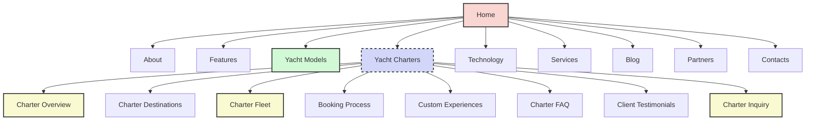
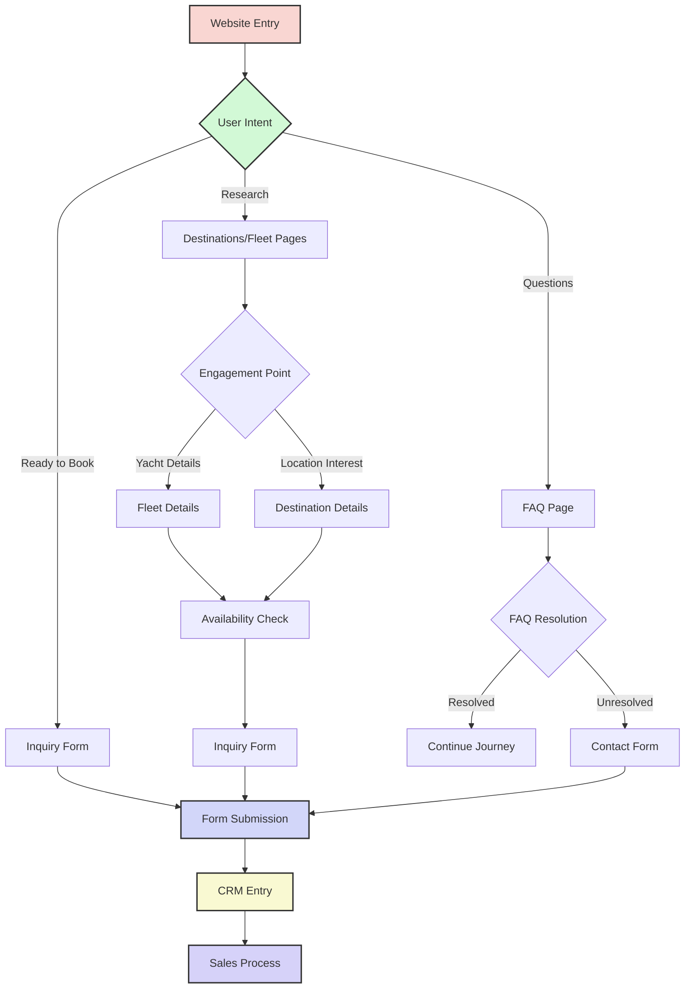
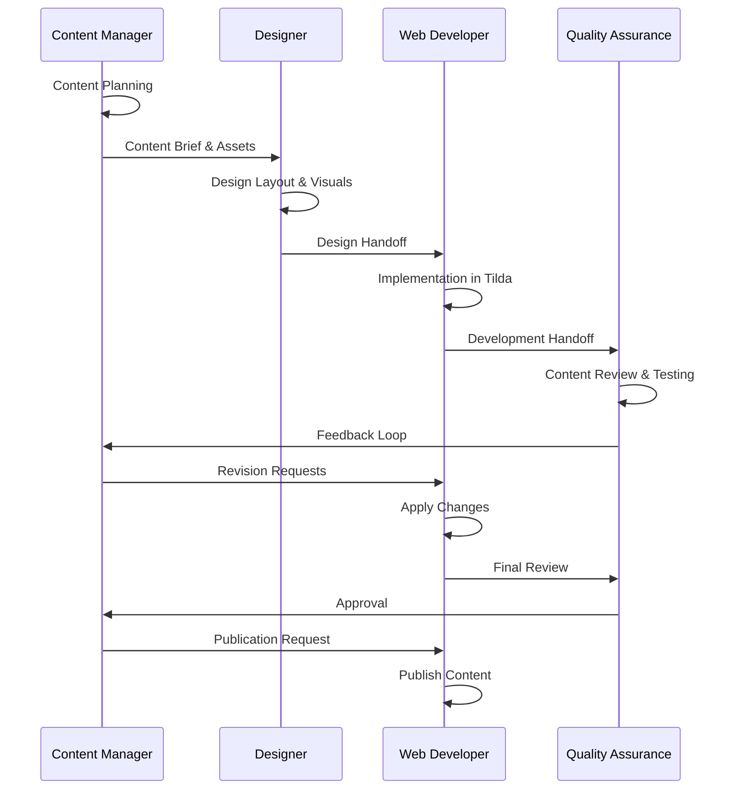
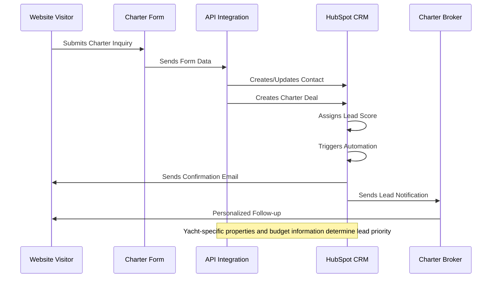
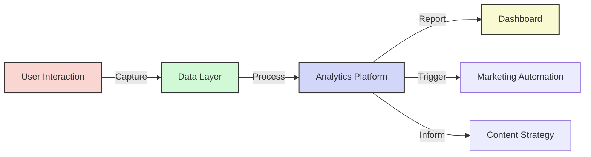

# Yacht Charters Section: Documentation & UX Optimization

This document outlines the implementation of a Yacht Charters section for the Azure Yacht Group website, including architecture, content strategy, integration with existing systems, and user experience recommendations.

## Table of Contents

1. [Website Structure Updates](#website-structure-updates)
2. [Yacht Charters Architecture](#yacht-charters-architecture)
3. [Content Strategy](#content-strategy)
4. [User Experience Optimization](#user-experience-optimization)
5. [HubSpot CRM Integration](#hubspot-crm-integration)
6. [SEO Strategy](#seo-strategy)
7. [Analytics & Performance Tracking](#analytics--performance-tracking)
8. [Implementation Roadmap](#implementation-roadmap)
9. [UX Best Practices for Luxury Yacht Websites](#ux-best-practices-for-luxury-yacht-websites)

## Website Structure Updates

### Current vs. Enhanced Structure

The current to-be website structure will be enhanced with a dedicated Yacht Charters section:

### Navigation Integration

The Yacht Charters section will be added to the main navigation menu as a primary-level item, reflecting its importance as a core service offering.

## Yacht Charters Architecture

### Page Structure & Content Hierarchy

1. **Charter Overview Page**
   - Hero section with compelling imagery
   - Value proposition section
   - Charter types overview
   - Featured destinations
   - Charter benefits
   - Call-to-action section

2. **Destinations Page**
   - Interactive map interface
   - Region-based navigation
   - Seasonal recommendations
   - Curated itineraries
   - Local attractions and highlights

3. **Charter Fleet Page**
   - Filterable yacht catalog
   - Detailed yacht specifications
   - Rich image galleries
   - Availability calendar
   - Price estimates or ranges
   - Quick inquiry capability

4. **Booking Process Page**
   - Step-by-step guide visualization
   - Required documentation section
   - Payment terms and options
   - Cancellation policy
   - Insurance information

5. **Custom Experiences Page**
   - Themed charter packages
   - Special occasion offerings
   - Concierge services
   - Additional amenities
   - Partner experiences (diving, culinary, etc.)

6. **Charter FAQ Page**
   - Structured Q&A with schema markup
   - Categorized questions
   - Expandable answers
   - Related content links

7. **Testimonials Page**
   - Client reviews with rich media
   - Before/after experience stories
   - Video testimonials
   - Charter highlights gallery

8. **Charter Inquiry Page**
   - Multi-step intuitive form
   - Date picker with availability hints
   - Yacht selector with thumbnails
   - Budget range selector
   - Preference customization options

### User Flow Architecture

## Content Strategy

### Content Types & Formats

1. **Destination Guides**
   - Rich descriptive content
   - High-quality photography
   - Interactive maps
   - Seasonal highlights
   - Local cultural information
   - Suggested activities

2. **Yacht Profiles**
   - Technical specifications
   - Feature highlights
   - Interior/exterior photography
   - 360° virtual tours
   - Crew information
   - Sample menus
   - Available water toys

3. **Experience Narratives**
   - First-person storytelling
   - Day-by-day itinerary examples
   - Guest testimonials
   - Highlight videos
   - Photo galleries

4. **Educational Content**
   - Charter preparation guides
   - First-time charterer information
   - Yachting etiquette
   - Packing recommendations
   - Destination guides

### Content Creation Workflow

## User Experience Optimization

### Enhanced To-Be Model Optimizations

The proposed to-be model can be optimized for best user experience through:

1. **Journey-Based Navigation**
   - Reorganize navigation based on user journeys rather than strict hierarchies
   - Implement a "yacht finder" tool to help users quickly find relevant vessels
   - Create clear pathways for different user intentions (buy, charter, learn)

2. **Personalized Content Presentation**
   - Implement progressive content disclosure to reduce cognitive load
   - Create personalized content recommendations based on browsing history
   - Develop smart forms that adapt based on user inputs

3. **Responsive Design Enhancements**
   - Optimize for various device types, especially tablets and mobile devices
   - Implement context-specific interfaces for different scenarios
   - Create device-specific features (e.g., tap-to-call on mobile)

4. **Performance Optimization**
   - Implement lazy loading for image-heavy pages
   - Optimize image delivery based on connection speed
   - Utilize content delivery networks for global audience

5. **Accessibility Improvements**
   - Ensure WCAG 2.1 AA compliance throughout the site
   - Implement keyboard navigation for all interactive elements
   - Provide alternative text for all images

### User Interface Recommendations

```mermaid
graph TD
    A[User Interface Layer] --> B[Navigation System]
    A --> C[Content Presentation]
    A --> D[Interaction Design]
    A --> E[Visual Hierarchy]
    
    B --> B1[Mega Menu]
    B --> B2[Breadcrumbs]
    B --> B3[Contextual Navigation]
    B --> B4[Search Functionality]
    
    C --> C1[Progressive Disclosure]
    C --> C2[Content Chunking]
    C --> C3[Multimedia Integration]
    C --> C4[Responsive Layouts]
    
    D --> D1[Microinteractions]
    D --> D2[Form Design]
    D --> D3[Call-to-Action Placement]
    D --> D4[Feedback Mechanisms]
    
    E --> E1[Typography Hierarchy]
    E --> E2[Color Psychology]
    E --> E3[Whitespace Utilization]
    E --> E4[Focal Points]
    
    style A fill:#f9d6d2,stroke:#333,stroke-width:2px
    style B fill:#d2f9d6,stroke:#333,stroke-width:2px
    style C fill:#d2d6f9,stroke:#333,stroke-width:2px
    style D fill:#f9f9d2,stroke:#333,stroke-width:2px
    style E fill:#d6d2f9,stroke:#333,stroke-width:2px
```

## HubSpot CRM Integration

### Charter-Specific Data Model

Extend the existing HubSpot integration with charter-specific properties:

1. **Contact Properties**
   - `charter_interest` (Boolean)
   - `charter_experience_level` (Dropdown: First-time, Occasional, Experienced)
   - `preferred_destinations` (Multi-select)
   - `charter_budget_range` (Dropdown)
   - `preferred_yacht_size` (Dropdown)
   - `special_requirements` (Text area)

2. **Deal Properties**
   - `charter_start_date` (Date)
   - `charter_end_date` (Date)
   - `charter_destination` (Dropdown)
   - `charter_yacht` (Dropdown)
   - `guest_count` (Number)
   - `special_occasions` (Multi-select)
   - `additional_services` (Multi-select)

### Charter Lead Workflow

## SEO Strategy

### Charter-Specific SEO Implementation

1. **Keyword Strategy**
   - Primary keywords: "luxury yacht charter," "yacht rental," "[destination] yacht charter"
   - Long-tail keywords: "weekly yacht charter in [destination]," "luxury sailing charter with crew"
   - Seasonal keywords: "summer yacht charter in Mediterranean," "winter Caribbean yacht rental"

2. **Structured Data Implementation**
   - Apply TripAction schema for charter offerings
   - Implement Product schema for individual yacht listings
   - Add Review schema for testimonials
   - Include FAQ schema for frequently asked questions

3. **Content Optimization**
   - Develop destination guides optimized for location-based searches
   - Create yacht-specific content with technical specifications
   - Publish expert advice articles to establish authority

## Analytics & Performance Tracking

### Key Performance Indicators

1. **Engagement Metrics**
   - Time on charter pages
   - Interaction rate with yacht profiles
   - Virtual tour completion rate
   - Destination guide read-through rate

2. **Conversion Metrics**
   - Charter inquiry form completion rate
   - Inquiry-to-booking ratio
   - Average lead qualification time
   - Return visitor conversion rate

3. **Business Metrics**
   - Charter revenue by vessel
   - Seasonal booking distribution
   - Destination popularity
   - Average charter duration

### Analytics Implementation

## Implementation Roadmap

### Phase 1: Strategy & Planning (Weeks 1-2)
- Define charter service offerings
- Conduct competitive analysis
- Develop content strategy
- Create design concepts

### Phase 2: Content Development (Weeks 3-5)
- Write core page content
- Create destination guides
- Develop yacht profiles
- Produce multimedia assets

### Phase 3: Implementation in Tilda (Weeks 6-8)
- Create page templates
- Develop interactive components
- Implement responsive design
- Set up form integrations

### Phase 4: CRM Integration (Weeks 9-10)
- Configure HubSpot properties
- Set up automation workflows
- Create email templates
- Test data flow

### Phase 5: Testing & Optimization (Weeks 11-12)
- Conduct usability testing
- Perform SEO validation
- Test cross-device compatibility
- Optimize performance

### Phase 6: Launch & Promotion (Weeks 13-14)
- Soft launch to selected audiences
- Gather initial feedback
- Full public launch
- Implement marketing campaign

## UX Best Practices for Luxury Yacht Websites

### 1. Visual Storytelling

**Implementation Recommendations:**
- Use hero video backgrounds showing yacht experiences
- Implement parallax scrolling for depth and engagement
- Create visual narratives that follow the charter journey
- Use high-quality photography that evokes emotional responses

### 2. High-End Interactive Elements

**Implementation Recommendations:**
- Develop 360° virtual yacht tours
- Create interactive deck plans with hotspots
- Implement smooth, elegant animations for transitions
- Develop an interactive destination explorer

### 3. Intuitive Navigation Systems

**Implementation Recommendations:**
- Design clear, minimalist navigation
- Implement intelligent search with filters
- Create consistent breadcrumb trails
- Use sticky navigation on long-scroll pages

### 4. Personalization

**Implementation Recommendations:**
- Implement content recommendation engines
- Create location-based content suggestions
- Design preference-based yacht matching tools
- Develop personalized itinerary builders

### 5. Simplified Complexity

**Implementation Recommendations:**
- Use progressive disclosure for detailed information
- Implement expandable sections for technical specifications
- Create intuitive filtering systems for yacht selection
- Design multi-step forms with progress indicators

### 6. Mobile-First Luxury Experience

**Implementation Recommendations:**
- Design touch-friendly interfaces
- Implement gesture-based navigation
- Create device-specific features
- Design layouts that maintain luxury feel on small screens

### 7. Seamless Inquiry Process

**Implementation Recommendations:**
- Design multi-step forms that feel conversational
- Implement real-time validation and helpful error messages
- Create smart forms that adapt based on previous selections
- Design clear call-to-action buttons with appropriate urgency

### 8. Performance Optimization

**Implementation Recommendations:**
- Implement lazy loading for image galleries
- Use next-gen image formats with fallbacks
- Optimize video delivery through streaming
- Implement predictive loading for likely user paths

## Conclusion

The addition of a Yacht Charters section, paired with overall UX optimizations to the to-be model, will significantly enhance the Azure Yacht Group website. By implementing these recommendations, the website will better serve potential charter clients while maintaining the luxury brand positioning and improving overall user experience.

The UX optimizations for the to-be model focus on creating intuitive pathways, reducing cognitive load, and presenting information in a visually compelling manner that reflects the premium nature of the Azure Yacht Group brand. 